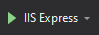

# EventApi

## Description

The use-case is a simple event ticketing system. A single event has a pre-defined pool of available tickets that can be sold to customers. After the  pool limit has been reached, any further purchase request should be rejected. 

## User Stories

 The API should expose endpoints that support the following User Stories:

- > As an Event Manager
  >  ​ I want to be able to create/delete events
  >  ​ So that I can manage events and set ticket pools ​ ​ ​

- > As a Potential Event Participant
  >  ​ I want to be able to buy a ticket for a selected event passing first name, last name, and email
  >  ​ So that I can secure my participation before tickets are sold out ​ ​ ​

- > As an Event Participant
  >  ​ I want to be able to return my ticket
  >  ​ So that I can cancel my participation and allow others to join ​ ​ ​

- > As a Potential Event Participant
  >  ​ I want to get event details
  >  ​ So that I can check tickets availability ​ ​ ​

- > As a Potential Event Participant
  >  ​ I want to list all events and see their ticket availability
  >  ​ So that I can select an event I want to participate in ​ ​ ​

- > As an Event Manager
  >  ​ I want to list all tickets for selected event
  >  ​ So that I can see participants list ​ ​ ​

- > As an Event Manager
  >  ​ I want to increment tickets pool of selected event
  >  ​ So that more people can participate ​ ​ ​

## Startup

In Package Manager Console run

> update-database

then run app as ISS Express

